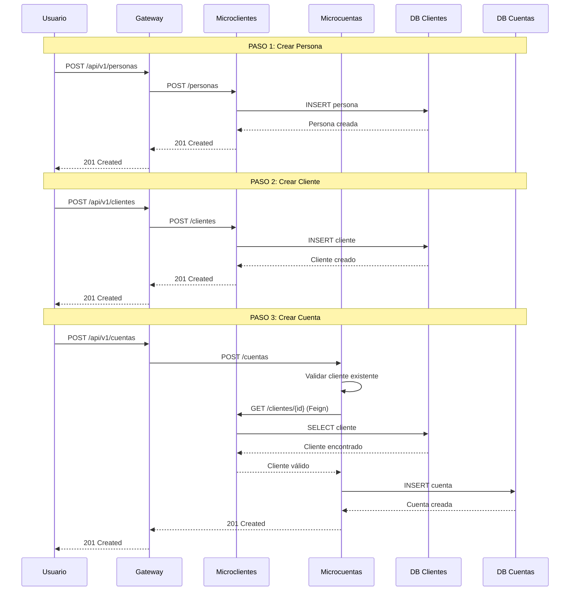
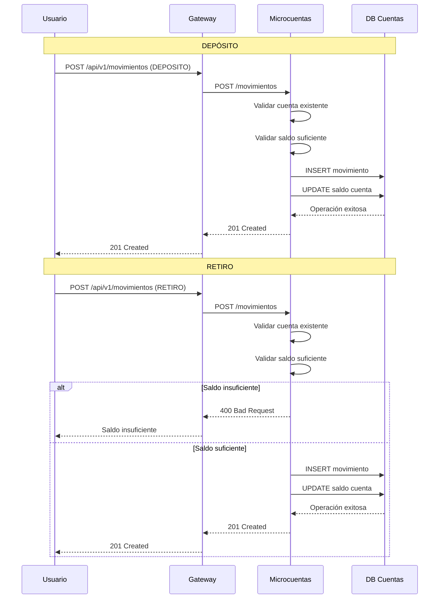
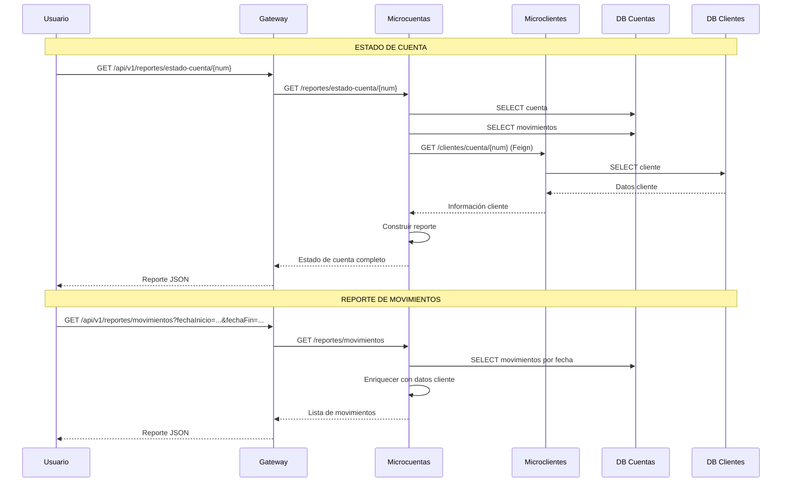
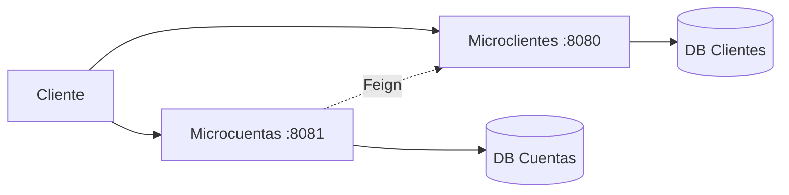
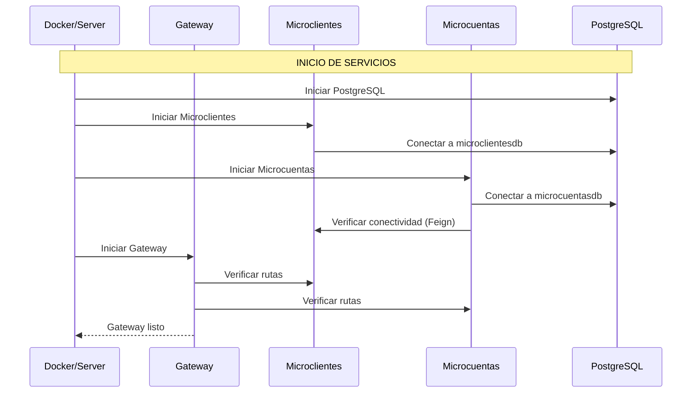
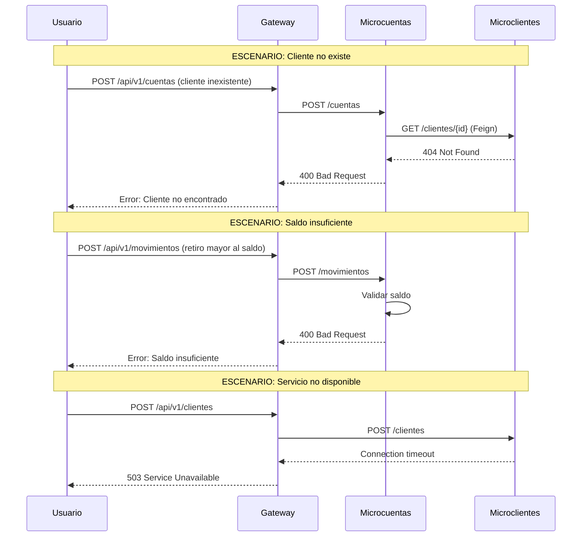

# 🔄 Flujos Completos del Sistema Bancario

## 🏦 Flujo 1: Apertura de Cuenta Bancaria

### **Secuencia Completa**



### **Ejemplo de Datos**

#### 1. Crear Persona
```bash
curl -X POST http://localhost:8083/api/v1/personas \
  -H "Content-Type: application/json" \
  -d '{
    "identificacion": "1234567890",
    "nombre": "María González",
    "genero": "F",
    "edad": 28,
    "direccion": "Calle 45 #12-34",
    "telefono": "3009876543"
  }'
```

#### 2. Crear Cliente
```bash
curl -X POST http://localhost:8083/api/v1/clientes \
  -H "Content-Type: application/json" \
  -d '{
    "clienteid": "CLI002",
    "contrasena": "maria2024",
    "estado": "ACTIVO",
    "identificacion": "1234567890"
  }'
```

#### 3. Crear Cuenta
```bash
curl -X POST http://localhost:8083/api/v1/cuentas \
  -H "Content-Type: application/json" \
  -d '{
    "numeroCuenta": "002-987654-32",
    "tipoCuenta": "CORRIENTE",
    "saldoInicial": 500000,
    "estado": "ACTIVA",
    "clienteId": "CLI002"
  }'
```

## 💰 Flujo 2: Operaciones Bancarias

### **Secuencia de Movimientos**



### **Ejemplos de Movimientos**

#### Depósito
```bash
curl -X POST http://localhost:8083/api/v1/movimientos \
  -H "Content-Type: application/json" \
  -d '{
    "fecha": "2024-01-15T14:30:00",
    "tipoMovimiento": "DEPOSITO",
    "valor": 750000,
    "numeroCuenta": "002-987654-32"
  }'
```

#### Retiro
```bash
curl -X POST http://localhost:8083/api/v1/movimientos \
  -H "Content-Type: application/json" \
  -d '{
    "fecha": "2024-01-15T16:45:00",
    "tipoMovimiento": "RETIRO",
    "valor": 200000,
    "numeroCuenta": "002-987654-32"
  }'
```

## 📊 Flujo 3: Generación de Reportes

### **Secuencia de Reportes**



### **Ejemplos de Reportes**

#### Estado de Cuenta
```bash
curl -X GET "http://localhost:8083/api/v1/reportes/estado-cuenta/002-987654-32"
```

**Respuesta:**
```json
{
  "cuenta": {
    "numeroCuenta": "002-987654-32",
    "tipoCuenta": "CORRIENTE",
    "saldoInicial": 500000,
    "estado": "ACTIVA"
  },
  "cliente": {
    "clienteid": "CLI002",
    "nombre": "María González",
    "identificacion": "1234567890"
  },
  "movimientos": [
    {
      "id": 1,
      "fecha": "2024-01-15T14:30:00",
      "tipoMovimiento": "DEPOSITO",
      "valor": 750000,
      "saldo": 1250000
    },
    {
      "id": 2,
      "fecha": "2024-01-15T16:45:00",
      "tipoMovimiento": "RETIRO",
      "valor": 200000,
      "saldo": 1050000
    }
  ]
}
```

#### Reporte de Movimientos por Fecha
```bash
curl -X GET "http://localhost:8083/api/v1/reportes/movimientos?fechaInicio=2024-01-15T00:00:00&fechaFin=2024-01-15T23:59:59"
```

## 🔄 Flujo 4: Operaciones Independientes (Sin Gateway)

### **Acceso Directo a Microservicios**



### **Endpoints Directos**

#### Microclientes (Puerto 8080)
```bash
# Crear persona
curl -X POST http://localhost:8080/personas \
  -H "Content-Type: application/json" \
  -d '{"identificacion": "1234567890", "nombre": "Juan Pérez"}'

# Crear cliente
curl -X POST http://localhost:8080/clientes \
  -H "Content-Type: application/json" \
  -d '{"clienteid": "CLI003", "contrasena": "juan123", "estado": "ACTIVO", "identificacion": "1234567890"}'
```

#### Microcuentas (Puerto 8081)
```bash
# Crear cuenta
curl -X POST http://localhost:8081/cuentas \
  -H "Content-Type: application/json" \
  -d '{"numeroCuenta": "003-111111-11", "tipoCuenta": "AHORROS", "saldoInicial": 1000000, "estado": "ACTIVA", "clienteId": "CLI003"}'

# Realizar movimiento
curl -X POST http://localhost:8081/movimientos \
  -H "Content-Type: application/json" \
  -d '{"fecha": "2024-01-15T10:00:00", "tipoMovimiento": "DEPOSITO", "valor": 500000, "numeroCuenta": "003-111111-11"}'
```

## 🚀 Flujo 5: Despliegue y Monitoreo

### **Secuencia de Inicio**



### **Verificación de Estado**

```bash
# Verificar Gateway
curl http://localhost:8083/gateway/health

# Verificar Microclientes
curl http://localhost:8080/actuator/health

# Verificar Microcuentas
curl http://localhost:8081/actuator/health

# Verificar rutas del Gateway
curl http://localhost:8083/gateway/routes
```

## 📈 Flujo 6: Escenarios de Error

### **Manejo de Errores**



### **Códigos de Error Comunes**

| Código | Descripción | Solución |
|--------|-------------|----------|
| 400 | Datos inválidos | Verificar formato JSON y campos requeridos |
| 404 | Recurso no encontrado | Verificar ID de cliente/cuenta |
| 409 | Conflicto de datos | Cliente o cuenta ya existe |
| 503 | Servicio no disponible | Verificar que el microservicio esté ejecutándose |

## 🎯 Resumen de Flujos

### **Flujos Principales**

1. **Apertura de Cuenta**: Persona → Cliente → Cuenta
2. **Operaciones Bancarias**: Depósitos y Retiros
3. **Reportes**: Estado de cuenta y movimientos
4. **Monitoreo**: Health checks y logs

### **Puntos de Entrada**

- **Con Gateway**: `http://localhost:8083/api/v1/*`
- **Sin Gateway**: 
  - Microclientes: `http://localhost:8080/*`
  - Microcuentas: `http://localhost:8081/*`

### **Comunicación entre Servicios**

- **OpenFeign**: Microcuentas → Microclientes
- **Gateway**: Cliente → Microservicios
- **Base de Datos**: Cada microservicio → Su BD

---

**Este documento muestra todos los flujos posibles del sistema bancario, tanto a través del gateway como de manera independiente.** 
